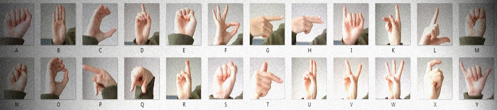
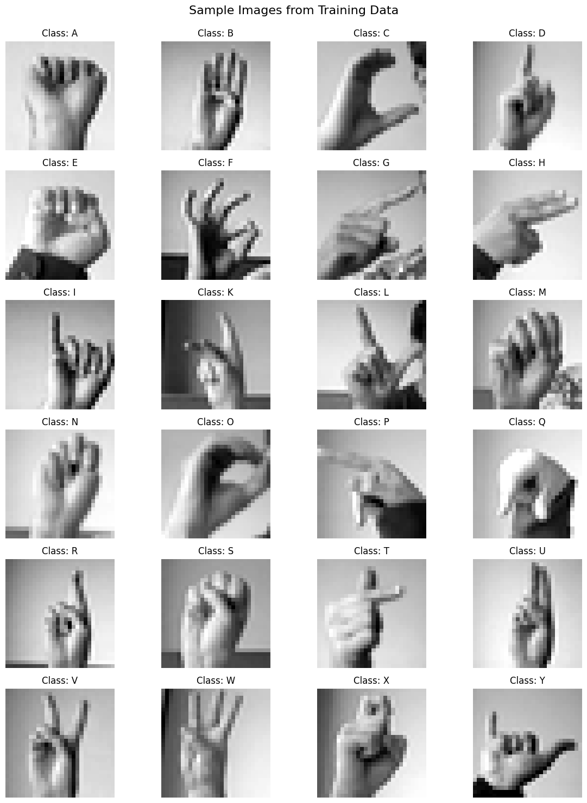
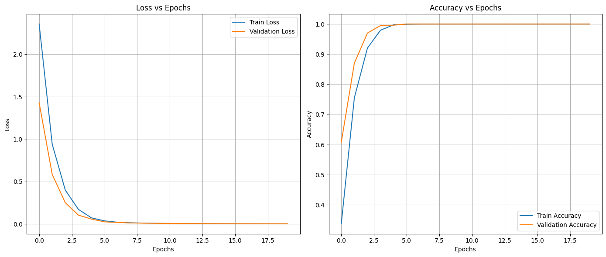
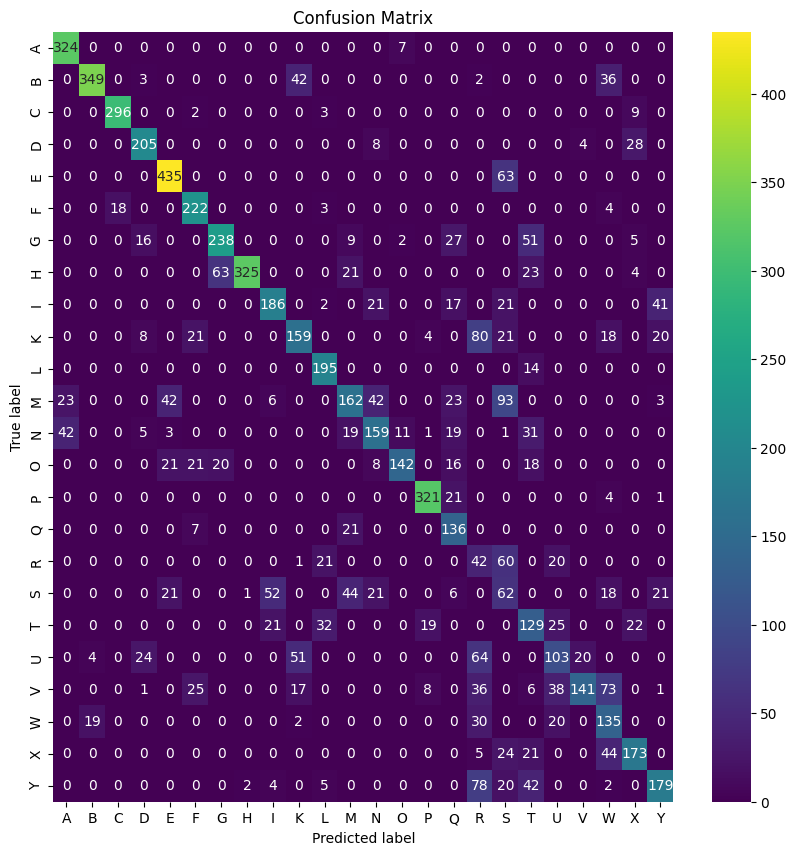
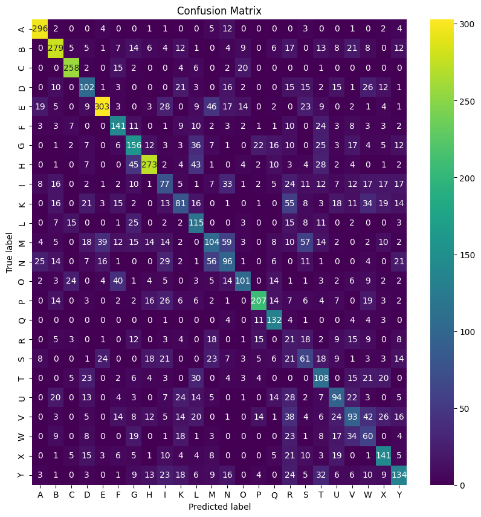
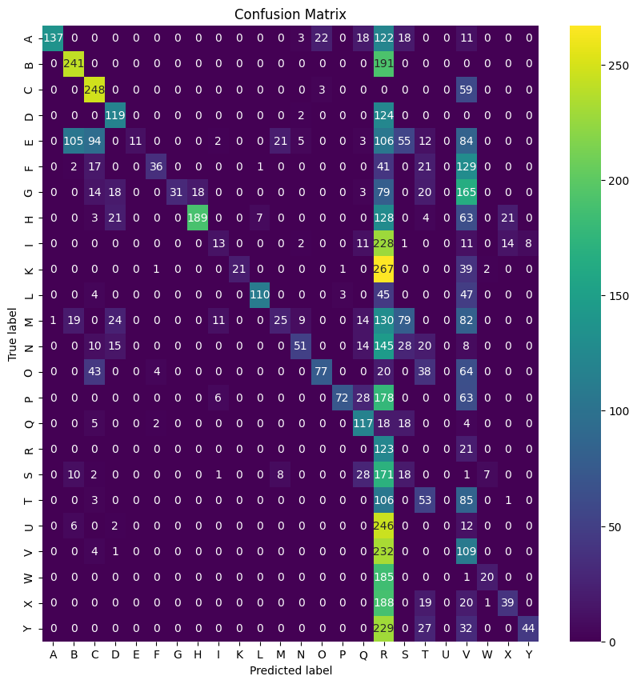
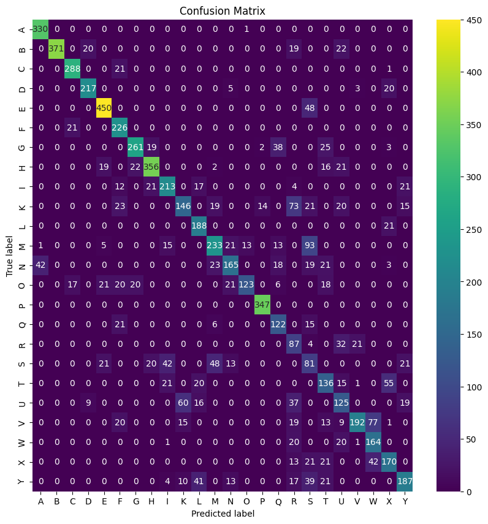
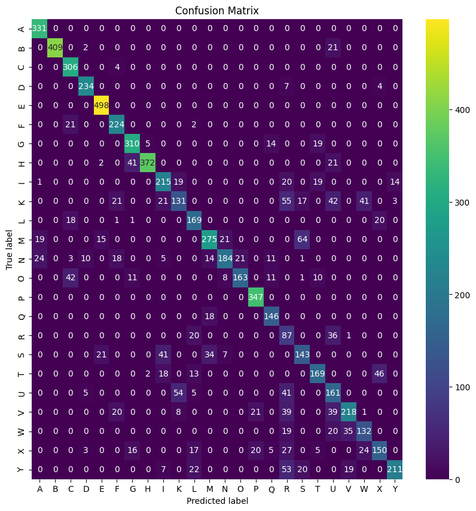
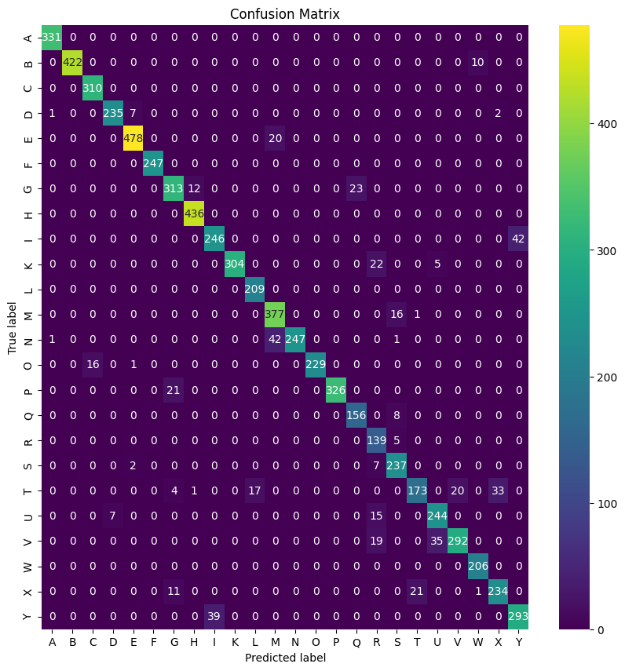
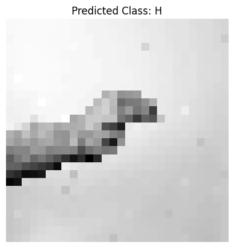

# HandTalk: Translating Sign Language to Text

  
*A bridge between sign language users and the world.*

---

## Introduction

**HandTalk** is a machine learning-based solution to bridge the communication gap between sign language users and non-users. It uses the **Sign Language MNIST** dataset to classify static hand gestures into their corresponding alphabets. The project explores various models and concludes with a **Convolutional Neural Network (CNN)** as the best-performing model with an accuracy of **93.52%**.

---

## Features

- **Dataset Used**: [Sign Language MNIST](https://www.kaggle.com/datamunge/sign-language-mnist)  
  - Dataset comprises grayscale 28x28 images representing 24 static hand gestures (excluding 'J' and 'Z').

### Dataset Samples  
  

---

## Pipeline Overview

1. **Data Preprocessing**:
   - **Normalization**: Pixel values are normalized to the range [0, 1].
   - **Dimensionality Reduction**: Principal Component Analysis (PCA) reduces features from 784 to 50 for efficient training.

2. **Model Training**:
   - Each model is trained on the dataset, followed by **GridSearchCV** for hyperparameter optimization.
   - Key hyperparameters include penalty, max iterations, learning rate, and activation functions, tuned to improve performance.

3. **Evaluation Metrics**:
   - Models are evaluated using accuracy, precision, recall, and F1-score metrics on the test dataset.

4. **CNN Model Architecture**:
   The CNN consists of convolutional layers for feature extraction, pooling layers for dimensionality reduction, and fully connected layers for classification.

| **Layer**      | **Parameters**                          |
|-----------------|-----------------------------------------|
| Conv2D         | Filters: 32, Kernel: (3,3), Activation: ReLU |
| MaxPooling2D   | Pool size: (2,2), Strides: 2            |
| Conv2D         | Filters: 128, Kernel: (3,3), Activation: ReLU |
| MaxPooling2D   | Pool size: (2,2), Strides: 2            |
| Dense          | Units: 128, Activation: Tanh           |
| Output Layer   | Units: 25, Activation: Softmax          |

5. **Model Selection**:
   - Based on performance metrics, CNN is identified as the best model with **93.52% accuracy**, showcasing its robustness in image-based classification.

6. **Prediction**:
   - The trained CNN model is used to predict unseen gestures.

### Training Graphs  
  

---

## Results  

### Confusion Matrices for Models  

    

    
    
    

    
    
    

---

### Best Hyperparameters from Grid Search CV  

| **Model**              | **Hyperparameter**       | **Best Value**              |
|-------------------------|--------------------------|-----------------------------|
| Logistic Regression     | Penalty                 | L2                          |
|                         | Solver                  | Saga                        |
|                         | C                       | 0.01                        |
|                         | Max Iterations          | 200                         |
| Decision Tree           | Criterion               | Entropy                     |
|                         | Max Depth               | None                        |
|                         | Min Samples Leaf        | 1                           |
|                         | Min Samples Split       | 2                           |
|                         | Splitter                | Best                        |
| Random Forest           | Criterion               | Gini                        |
|                         | Max Depth               | None                        |
|                         | Min Samples Leaf        | 1                           |
|                         | Min Samples Split       | 2                           |
|                         | Number of Estimators    | 100                         |
| Perceptron              | Penalty                 | L1                          |
|                         | Alpha                   | 0.001                       |
|                         | Max Iterations          | 1000                        |
|                         | Tolerance               | 0.001                       |
| Multi-Layer Perceptron  | Activation              | ReLU                        |
|                         | Alpha                   | 0.001                       |
|                         | Hidden Layer Sizes      | (128,)                      |
|                         | Learning Rate           | Constant                    |
|                         | Max Iterations          | 500                         |
|                         | Solver                  | SGD                         |
| Support Vector Machine  | Kernel                  | Linear                      |
|                         | C                       | 0.1                         |
|                         | Gamma                   | Scale                       |
| CNN                    | Optimizer               | Adam                        |
|                         | Learning Rate           | 0.0005                      |
|                         | Loss Function           | Sparse Categorical Crossentropy |

---

### Final Prediction  

    
    

---

## Model Performance

| **Model**               | **Accuracy** | **Precision** | **Recall** | **F1-Score** |
|--------------------------|--------------|---------------|------------|--------------|
| Logistic Regression      | 69.38%       | 72.46%        | 69.38%     | 69.88%       |
| Decision Tree            | 47.87%       | 49.81%        | 47.87%     | 48.35%       |
| Random Forest            | 81.19%       | 83.53%        | 81.19%     | 81.59%       |
| Perceptron               | 26.55%       | 65.13%        | 26.55%     | 29.85%       |
| Multi-Layer Perceptron   | 76.14%       | 76.61%        | 76.14%     | 75.83%       |
| Support Vector Machine   | 84.19%       | 85.68%        | 84.19%     | 84.44%       |
| **Convolutional Neural Network** | **93.52%**   | **93.76%**    | **93.52%** | **93.47%** |

---

## Contributors

| Name             | GitHub                         | Email                       |
|------------------|-------------------------------|-----------------------------|
| **Aakash**       | [GitHub](https://github.com/Aakash391) | aakash21002@iiitd.ac.in     |
| **Parveen**      | [GitHub](https://github.com/parveen2002p) | parveen21079@iiitd.ac.in    |
| **Shubham Sharma** | [GitHub](https://github.com/SHUBHAMSHARMA0711) | shubham21099@iiitd.ac.in |
| **Pourav Surya** | [GitHub](https://github.com/Pourav619) | pourav21271@iiitd.ac.in     |
